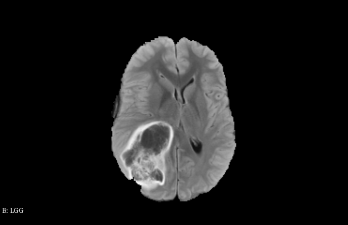
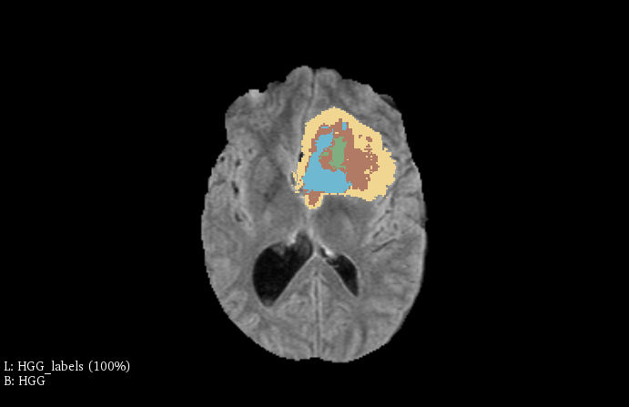
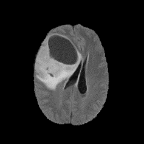
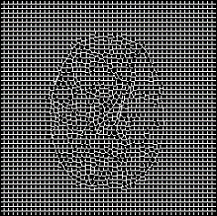
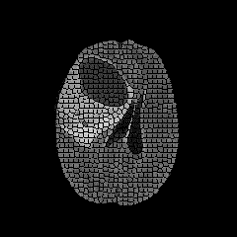
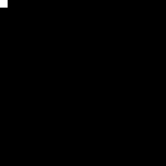
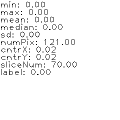
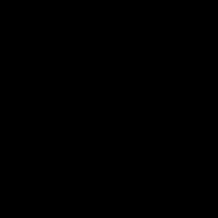

# Brain tumour segmentation
In this project I propose a method for brain tumour segmentation of MRI volumes using superpixels and Support Vector Machine from OpenCV library in the 2D slice fashion. 

The implementation contains parts written in Python and C++ languages. Python was used mostly because volumetric data cannot be processed by OpenCV itself, so the SimpleITK library in Python was used to read the data and transform it into images, which the OpenCV can work with. 

## Dataset BraTS2015
The solution was implemented and evaluated on [BraTS2015](https://www.smir.ch/BRATS/Start2015) dataset, which contains MRI volumetric data of brain tumours. The dataset contains 254 volumetric samples, each containing 4 MRI modalities (T1, T1c, T2, Flair) and corresponding ground truth segmentation labels of tumour. The resolution of each sample is 240 x 240 x 240 px. To simplify the solution, I reduced the segmentation labels into 2 classes:
* 1 for tumour
* 0 for everything else.

Here are some examples from the dataset.


<figure>
<p float="left">
  
</p>
<figcaption>Fig. 1: Example of sample image of flair MRI modality:
</figcaption>
</figure>
<br/><br/>
<figure>
<p float="left">
  
</p>
<figcaption>Fig. 2: Example of sample image of flair MRI modality with segmentation labels done in 3D Slicer.</figcaption>
</figure>
<br/><br/>

## Method

1. Firstly, the volumetric data is preprocessed using z-score normalisation and transformed into images using python script ```load_volume.py```. The train and test data splits are formed with 80:20 ratio. Then the superpixel segmentation is performed on each image, which separates the pixels of image into small regions, by its homogenity. 

```
Mat mask, result = image.clone(), slicLabels;
cv::Ptr<SuperpixelSLIC> superpixelsPtr = cv::ximgproc::createSuperpixelSLIC(image.clone(), cv::ximgproc::SLIC, this->superpixelSize, 50.0f);
superpixelsPtr->iterate(10);
superpixelsPtr->getLabelContourMask(mask, true);
result.setTo(Scalar(0, 0, 255), mask);
superpixelsPtr->getLabels(slicLabels);
int numberOfSuperpixels = superpixelsPtr->getNumberOfSuperpixels();
```
<figure>
<p float="left">
  
   
  
</p>
<figcaption>Fig. 3: The left figure shows the input image for the superpixel segmentation, the middle figure contains the superpixel mask and the right figure show the image after the segmentation.</figcaption>
</figure>
<br/><br/>

2. Then the features are crafted from each superpixels systematically. The features are minimum, maximum, mean, median and standard deviation of pixel intensity value, the horizontal and vertical coordinates of superpixel centroid, the depth of the slice, the number of pixels in the superpixel and the histogram of the superpixel. Features are then stored in the vector<vector<float>> featureVect structure.

```
double min, max, median, sd;
slice.copyTo(result, single_superpixels_mask);
cv::minMaxLoc(result, &min, &max, NULL, NULL, single_superpixels_mask);
Scalar mean_intensity = cv::mean(result, single_superpixels_mask);
int numberOfpixelsWithinSuperpixel = cv::countNonZero(single_superpixels_mask);
std::tie(median, sd) = medianAndSdOfSuperpixel(result, single_superpixels_mask, mean_intensity.val[0]);
int label = getLabelFromGroundTruthMask(labelsMask, single_superpixels_mask, penalisationRatio);
auto centroid = computeCendtroidForSuperpixel(single_superpixels_mask);
cv::Mat histogram;
float range[] = { 0, 256 };
const float* histRange = { range };
bool uniform = true, accumulate = false;
cv::calcHist(&inputImage, 1, 0, single_superpixels_mask, histogram, 1, &histSize, &histRange, uniform, accumulate);
```

<figure>
  <p float="left">
  
   
   
</p>
</a><figcaption>Fig. 4: Visualisation of the iterating through the superpixels from one image. In the left pictures is the superpixel mask, in the middle picture is the superpixel with the pixel intensities from the corresponding image and in the right picture there are corresponding features. If the superpixel consists only from black pixels, the features are not extracted from it and it can be directly classified as the background.</figcaption>
</figure>
<br/><br/>

3. Also each superpixel is marked with label, using the ground truth labels of the tumour. The superpixels belongs to the tumorous class, if at least 50% of its pixels correspond to the tumorous pixels of the ground truth mask. Labels of the given image are stored in the vector<int> labelsVect structure.

```
int label;
Mat gtMask = mask.clone();
Mat superpixelLabels;
labelsSlice.copyTo(superpixelLabels, gtMask);
int numberOfPixelsInSuperpixelMask = cv::countNonZero(gtMask);
int numberOfPixelsInSuperpixelLabels = cv::countNonZero(superpixelLabels);
if (numberOfPixelsInSuperpixelLabels >= numberOfPixelsInSuperpixelMask * ratio) {
    label = 1;
}
else {
    label = 0;
}
```
<figure>
  <p float="left">
  
   
</p>
</a><figcaption>Fig. 5: These figures shows the transformation of the ground truth segmentation mask into superpixel representation. This is needed for the superpixels, to be labeled. The left animated image represents the original segmentation mask and the right image is after the transformation.</figcaption>
</figure>
<br/><br/>

4. Then the crafted features are used to train the SVM to classify superpixels to be tumorous or not. 

```
float* featuresPtr = twoDimVectToOneDimPointer(featureVect);
int* labelsPtr = vectToPointer(labelsVect);

int numberOfSamples = featureVect.size();
int numberOfFeatures = featureVect[0].size();

Mat trainingDataMat(numberOfSamples, numberOfFeatures, CV_32F, featuresPtr);
Mat labelsMat(numberOfSamples, 1, CV_32SC1, labelsPtr);

this->svm->train(trainingDataMat, ROW_SAMPLE, labelsMat);
this->svm->save(this->svmModelName);
```
<br/><br/>

5. After the training we get the SVM model, which can be used for predicting classes for new data. We perform the prediction on test data, where each slice is processed by superpixe segmentation, the features are extracted and passed to the SVM, which determines the class of the superpixel. The superpixel is then colored by black color, if it not tumour, or white, if its tumour. 

```
for (int s = 0; s < numberOfSuperpixels; s++)
    {
        vector<float> features;
        int label;
        std::tie(features, label) = extractor.extractFeaturesFromSuperpixel(superpixelsResult, slicLabels, labelsImage, s, j);
        if (features.size() != 0) {
            Mat sampleMat = Mat(1, features.size(), CV_32F);
            memcpy(sampleMat.data, features.data(), features.size() * sizeof(float));
            
            int prediction = this->svm->predict(sampleMat);
            if (prediction == 1) {
                predictedImage.setTo(Scalar(255), (slicLabels == s));
            }
            else {
                predictedImage.setTo(Scalar(0), (slicLabels == s));
            }
            int groundTruthLabel = extractor.getLabelFromGroundTruthMask(labelsImage, slicLabels == s, 0.5);
            if (groundTruthLabel) {
                groundTruthMask.setTo(Scalar(255), (slicLabels == s));
            }
        }
        else {
            predictedImage.setTo(Scalar(0), (slicLabels == s));
        }
    }
```
<br/><br/>

6. The predicted image is then postprocessed using dilatation, after which the largest continuous contour is found and selected as segmentation mask. 

```
cv::dilate(predictedImage, predictedImage, element);

std::vector<std::vector<cv::Point>> contours;
cv::findContours(predictedImage, contours, cv::RETR_EXTERNAL, cv::CHAIN_APPROX_SIMPLE);

int maxContourId = getMaxAreaContourId(contours);
Mat result = Mat::zeros(predictedImage.size(), cv::IMREAD_GRAYSCALE);
if (maxContourId >= 0) {
    cv::drawContours(result, contours, maxContourId, cv::Scalar(255), cv::FILLED);
}
```

<figure>
  <p float="left">
  
   
</p>
</a><figcaption>Fig. 6: The final results. Right animated picture shows the predicted segmentation mask, which was create by the classification of each superpixel using SVM, whereas the left picture show the ground truth segmentation mask.</figcaption>
</figure>
<br/>

## Results

The SVM was trained using features, crafted from 199 training examples and evaluated on 55 testing examples. The evaluation of SVM superpixel classification is:
* Accuracy: 95,58%
* Precision: 93,13%
* Recall: 98,2%

The overall segmentation was evaluated using Dice coeficient, between images containing classificated superpixels and ground truth segmentation mask. The resulting Dice coefficient evaluated on 55 testing volumes is 0.614 ± 0.1960, which is due to the misclassified superpixels.

In comparison with my previsous work on Bachelors thesis, where I created CNN classifier used to classify each voxel of the volume to the specific class, I came up with results of Dice coefficient of 0.824 ± 0.1230.


